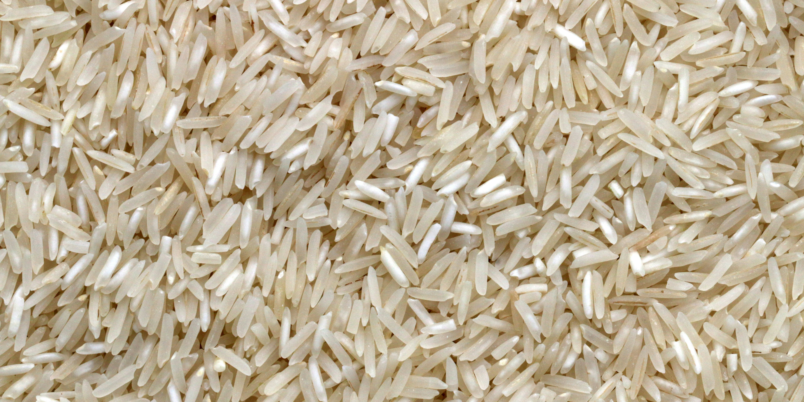

# Medium Rice Price Web Scraping
## Overview
This project collects daily rice commodity price data from the official [Siskaperbapo Jatim](https://siskaperbapo.jatimprov.go.id/) API. The data includes minimum, maximum, and average prices for rice within a specified date range. The scraped data is organized into a structured dataset that can be used for analysis, trend forecasting, or machine learning applications.



## Features
- **Data Scraping**: Automatically collects rice commodity prices for a given date range.
- **Price Data**: Collects minimum, maximum, and average prices for rice.
- **Customizable**: Users can define their desired date range and commodity.
- **Data Structure**: The collected data is stored in a structured format, making it suitable for analysis and further processing.

## Usage
1. **Data Scraping**: Use the provided functions to scrape the rice price data for a specific date range and commodity.
2. **Data Analysis**: After collecting the data, you can use pandas to perform further analysis or visualizations.

## Output Format
The scraped data is saved to a CSV file with the following columns:
- tanggal (date)
- min price
- max price
- avg price

## Requirements
- Python 3.x
- Libraries:
  - `requests` for making HTTP requests.
  - `pandas` for data handling and structuring.
  - `datetime` for manipulating date ranges.

## Installation

1. Clone this repository:
   ```bash
   git clone https://github.com/yourusername/rice-price-webscrapping.git
   ```
2. Install the required Python libraries
   ```bash
   pip install request pandas datetime
   ```
3. Open and Run `fetch_data.py`


